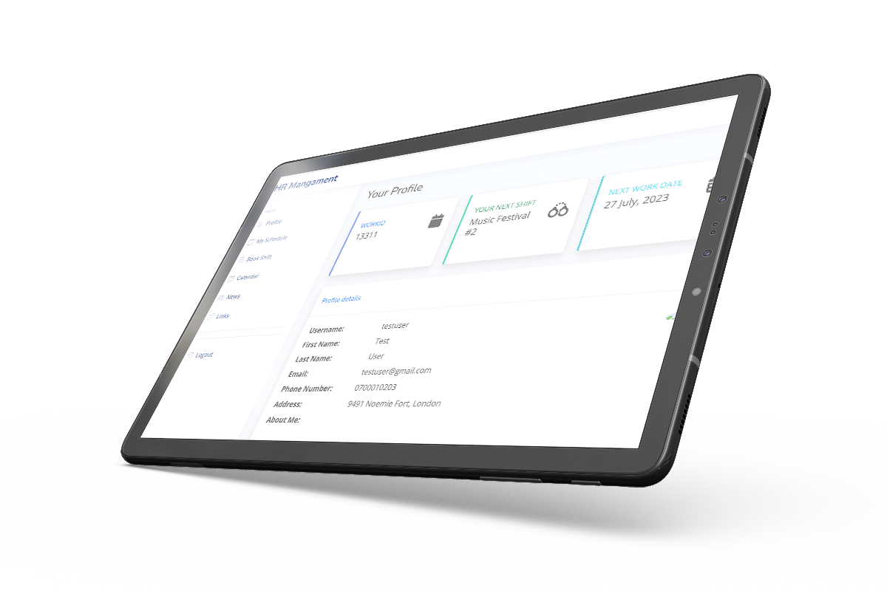
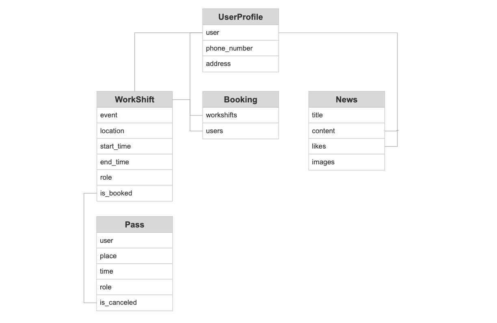

<div align="center">
  <a href="https://bjorne90.github.io/math-games-for-children/index.html" target="_blank">
    
  </a>

  <h3 align="center">Project 4 - HR Mangament</h3>

  <p align="center">
    My fullstack projekt | HR Mangament system for company
    <br />
    <br />
    <a href="https://hr-manager-bc.herokuapp.com/" target="_blank">View Demo Website</a>
  </p>
</div>

## Table of Contents
<!-- TABLE OF CONTENTS -->
<details>
  <summary>Table of Contents</summary>
  <ol>
    <li><a href="#Features">Features</a></li>
    <li><a href="#How-to-use-it">How to use it</a></li>
    <li><a href="#Known-Bugs-and-Fixes">Known Bugs and Fixes</a></li>
    <li><a href="#Data-Model">Data Models & ERD chart</a></li>
    <li><a href="#Validating-&-Testing">Validating & Testing</a></li>
    <li><a href="#Credits">Credits</a></li>
  </ol>
</details>
<br />


# HR Mangament 👫

HR Mangament is a web solution to facilitate the management of schedules and booking of personnel for work shifts. The system is developed so that users get their own profiles, can check their workshifts, cancel workshifts, update their profile picture and edit their profile. Admin can easily add new shifts, users and news.


## Features

1. **User Authentication**
   - Employees can register and log in to their accounts.
   - Admins have access to additional features and functionalities.

2. **Shift Management**
   - Employees can view their assigned shifts.
   - Employees can book shifts according to their availability.
   - Employees can cancel booked shifts if needed.
   - Admins can add, edit, and delete shifts.

3. **News and Updates**
   - Admins can create news articles to share important updates.
   - Users can view and read news articles.
   - Users can like on news articles.

4. **User Profile**
   - Users can update their profile information such as phone number and address.
   - Users can view their booked workshifts.

5. **Email Notifications**
   - Users receive email notifications when they book a shift.
   - Users receive email notifications for important updates and news. (**Still a bug**)

6. **Admin Dashboard**
   - Admins have access to a dashboard to manage users, shifts, and news articles.
   - Admins can view, edit and delete user profiles.


  

---

## How to use it

1. Clone the repository.
2. Install the required dependencies.
3. Configure the database settings in the settings file.
4. Run database migrations.
5. Start the development server.
6. You can also try it via [Demo Link](https://hr-manager-bc.herokuapp.com/) in the top of whis README


---

## Known Bugs and Fixes

* Users receive email notifications for important updates and news. **(*bug*)**
* Dubble email is sent when booking shift **(*Under investigation*)**
* Sometimes when user update profile image, the new image is not loading **(*Under investigation*)**
* Shifts are not always canceled when the user press on Cancel shift **(*Solved*)**
* Comments on articles was not showing at all **(*Removed the feature for now*)**

---

## Data Models & ERD chart

The project has following models:

### Authentication App Models

#### UserProfile

- `user` (OneToOneField to User)
- `phone_number` (CharField)
- `address` (CharField)
- `booked_workshifts` (ManyToManyField to Booking)

### Booking App Models

#### Pass

- `user` (ForeignKey to User)
- `place` (CharField)
- `time` (DateTimeField)
- `role` (CharField)
- `is_cancelled` (BooleanField)

#### Booking

- `workshift` (ForeignKey to WorkShift)
- `users` (ManyToManyField to User)

#### WorkShift

- `name` (CharField)
- `start_time` (DateTimeField)
- `end_time` (DateTimeField)
- `users` (ManyToManyField to User)

### News App Models

#### News

- `title` (CharField)
- `content` (TextField)
- `timestamp` (DateTimeField)
- `likes` (ManyToManyField to User)
- `comments` (ManyToManyField to User through Comment) **(*not in use*)**
- `image` (CloudinaryField)

#### Comment

- `post` (ForeignKey to News)
- `user` (ForeignKey to User)
- `content` (TextField)
- `timestamp` (DateTimeField)

#### Like

- `user` (ForeignKey to User)
- `news` (ForeignKey to News)
- `timestamp` (DateTimeField)

### Profiles App Models

#### Profile

- `user` (OneToOneField to User)
- `about_me` (TextField)
- `phone_number` (CharField)
- `address` (CharField)
- `booked_workshifts` (ManyToManyField to WorkShift)
- `work_title` (CharField)
- `profile_image` (ImageField)
- `work_id` (CharField)
- `ov_id` (CharField)

### Scheduling App Models

#### WorkShift

- `event` (CharField)
- `location` (CharField)
- `start_time` (DateTimeField)
- `end_time` (DateTimeField)
- `role` (CharField)
- `is_booked` (BooleanField)

#### Booking

- `user` (ForeignKey to User)
- `workshift` (ForeignKey to WorkShift)

## Entity-Relationship Diagram (ERD)



The above diagram represents the relationships between the entities in the HR Management system.


---

## Testings


The project underwent extensive testing to ensure its functionality, reliability, and security. The following types of tests were conducted:

- **Unit Tests**: Unit tests were written using the Django testing framework to ensure the correctness of individual components and functionalities of the project.

- **Integration Tests**: Integration tests were performed to validate the interactions between different components and ensure their seamless integration.

- **Cross-Browser Testing**: The project was tested on various browsers, including Chrome, Safari, and Firefox, to ensure cross-browser compatibility.

- **Responsive Design Testing**: The project's responsive design was thoroughly tested across multiple devices, such as desktops, tablets, and mobile devices, to ensure a consistent user experience.

- **End-to-End Tests**: End-to-end tests were conducted to simulate user interactions and verify the expected behavior of the application.

- **Performance Testing**: Performance testing was conducted to measure the application's response time, scalability, and resource usage under different loads.

- **Accessibility Testing**: Accessibility testing was performed to ensure compliance with accessibility standards, allowing users with disabilities to access and navigate the application effectively.

- **Database Testing**: Database tests were executed to verify the proper functioning of database operations, including data retrieval, modification, and deletion.

## Validation

- **W3C HTML, 3 errors.**

- **W3C CSS, no errors.**

---

## License

[](https://opensource.org/licenses/MIT)

---

## Requirements

Here is the list of required packages and dependencies for running the project:

- asgiref==3.6.0
- boto3==1.26.133
- botocore==1.29.133
- cloudinary==1.30.0
- dj-database-url==0.5.0
- dj3-cloudinary-storage==0.0.6
- Django==3.2.18
- django-cloudinary-storage==0.3.0
- django-storages==1.13.2
- gunicorn==20.1.0
- jmespath==1.0.1
- Pillow==9.5.0
- psycopg2==2.9.6
- python3-openid==3.2.0
- pytz==2023.3
- s3transfer==0.6.1
- sqlparse==0.4.4
- urllib3==1.26.15

```bash
please visit https://pypi.org/ for links
```


---

## Contributing

If you would like to contribute to this project, there are several ways you can get involved:

- Submit a pull request: If you have made any improvements or bug fixes, you can submit a pull request on GitHub. Your contributions are greatly appreciated.
- Open an issue: If you have any suggestions, feedback, or bug reports, please open an issue on the project's GitHub repository. It helps in tracking and addressing the problems effectively.

I appreciate any contributions, suggestions, or improvements to the project. Thank you for your support!


---

## Credits

* Pythons documentation about PEP8 guidelines
* The logo was create at [Canva](https://www.canva.com/)
* Mockup images is downloaded from [FreePik](https://www.freepik.com/)
* Thanks for the guides and links at [The Python Package Index](https://pypi.org/)

---

## Author

- Björn Centio - _Initial work_ - [Bjorne90](https://github.com/bjorne90)

---

## Contact

If you have any questions or suggestions, feel free to reach out to me at bjce90@gmail.com